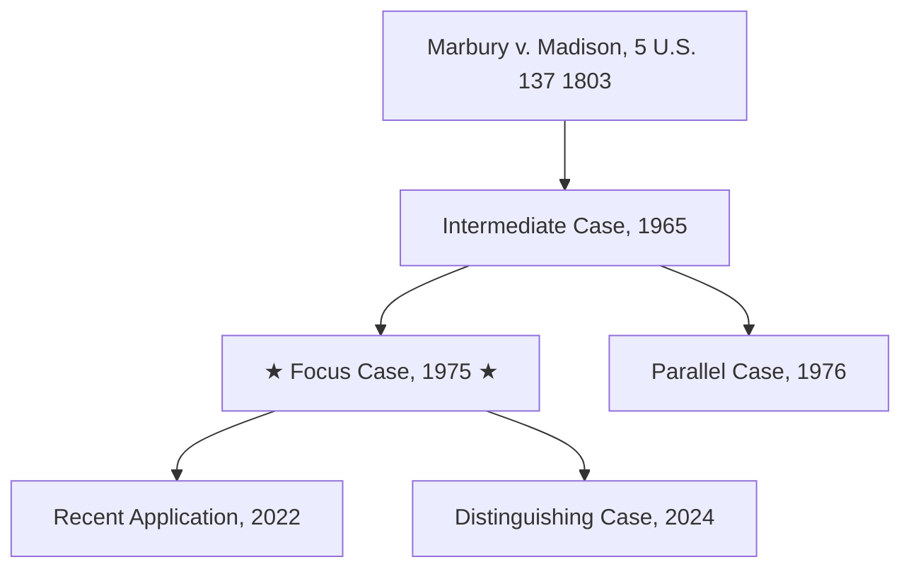

# Case Law Research — Deep

This is the deep-research variant. It is slow, expensive, and thorough. Standard research takes one disciplined pass; deep research recursively expands the citation network until you can speak to the doctrine's source, its development, its current state, and its open questions with confidence.

## When to use this skill

Use this skill only when the user explicitly asks for deep, comprehensive, or exhaustive research, or when the context makes clear that a normal-depth answer will not suffice (appellate brief, dispositive motion, formal legal opinion, bet-the-company question, novel issue of first impression). For routine "what does the case law say" questions, use `dingduff-case-law-research-standard` instead — it is cheaper and faster and good enough for the great majority of legal questions.

If you are unsure whether the user wants deep research, ask.

## CRITICAL: Anti-Hallucination Protocol

**NEVER** discuss a case's holding, reasoning, or quotes based on search snippets alone. Search snippets exist only to help you decide which cases to retrieve — they are not citable substance.

Before stating *any* holding or quoting *any* language:
1. Retrieve the actual opinion text via `opinion_store` (preferred — saves a local copy) or `opinion_view` (inline text only).
2. Cite by reporter citation and pinpoint page (e.g., *Miranda v. Arizona*, 384 U.S. 436, 444 (1966)). Reporter citations are the standard format for legal work product; cluster IDs are an internal CourtListener identifier and should not appear in citations to the user. Keep cluster IDs in your working notes and the case table for retrieval, but cite the reporter cite in any prose, memo, or brief.
3. If you cannot retrieve a case's text, do not discuss its substance — note that retrieval failed and move on.

## CRITICAL: The Overturn Problem

CourtListener does not flag overturned, abrogated, or limited cases. This means **you cannot rely on the database to tell you a case is no longer good law** — you have to find that out yourself, every time. Deep research is, in part, the discipline of doing this work properly.

For every case you intend to rely on in your final answer:
- Run `show_citing_opinions` against it, sorted by `-dateFiled`, and read the snippets of recent citing cases.
- Look for treatment signals in those snippets: "abrogated," "overruled," "is no longer good law," "rejected," "declined to follow," "limited to its facts," "called into doubt." Treat these as red flags requiring investigation.
- Also try a direct search: `opinion_search` with a query like `"<case name>" AND (overruled OR abrogated OR "no longer good law")`.
- If you find an adverse-treatment case, retrieve it via `opinion_store`, read it, and determine the scope of the treatment (full overruling, partial abrogation, narrowing, distinguishing).
- For SCOTUS or controlling appellate cases that are foundational, check at least the 20 most recent citing cases.

If a case has been overruled or substantially abrogated, do not present it as good law. Note the treatment, explain the current rule, and cite the case that did the overruling.

## Local Storage: The `saved cases` Folder

Whenever the user has connected (mounted, selected) a folder from their own computer, create a subfolder called `saved cases` inside that user-selected folder and save every retrieved opinion there as a markdown file. Deep research generates a lot of files; the local archive is also what makes the process tractable for you — you can re-read cases without burning more tool calls.

Use the user-visible folder you have been given access to — the same folder you would save any other user deliverable into. If you are unsure which folder that is, check the working-directory or folder-selection context in your environment before falling back. Do not use an internal agent scratchpad or temporary outputs directory for these files.

**Setup at the start of every research task:**

```bash
mkdir -p "<user_selected_folder>/saved cases"
```

**Naming convention:**

```
<cluster_id>_<short_case_name>_<reporter_cite>.md
```

Example: `107252_miranda_v_arizona_384_US_436.md`

Sanitize names: lowercase, replace spaces with underscores, strip punctuation other than underscores and dots, drop "v." → "v".

If no local directory is available, fall back to `opinion_view` for inline retrieval and tell the user no archive was produced. Deep research without a local archive is possible but considerably more painful — flag this so the user can decide whether to mount a folder before proceeding.

## Bookkeeping: The Working Set

Deep research expands quickly. To keep it tractable, maintain three working sets in your head (or in a scratch file in `saved cases/` if it helps):

- **Read** — cases you have retrieved, opened, and analyzed.
- **Frontier** — cases you have identified as worth retrieving but haven't read yet.
- **Pruned** — cases you considered and chose not to follow, with a one-line reason (off-topic, distinguishable on irrelevant grounds, redundant with a stronger authority).

Every iteration moves cases from the frontier into the read set, generates new frontier candidates from what you read, and prunes the obvious dead ends. The research is done when the frontier is empty, or what remains on the frontier is clearly redundant with what you already have.

## Phase 1: Initial Pass (Same as Standard)

Start the same way `dingduff-case-law-research-standard` starts. This gives you an anchor set you can expand from.

### 1a. Strategic search

Run 3–5 different search strategies to maximize coverage:

- **Natural language**: `opinion_search` with the legal issue in plain language plus appropriate `court_ids`, `court_types`, `states`, and date filters.
- **Boolean/phrase**: `opinion_search` with Boolean operators and exact-phrase doctrinal terms.
- **High-authority anchor**: `opinion_search` with `court_ids: "scotus"` and `order_by: "-citeCount"` to find the foundational SCOTUS treatment.
- **Jurisdiction-specific**: `opinion_search` with `court_types` and `states` filters for the relevant jurisdiction.
- **Field-specific**: `courtlistener_full_search` with `type: "o"` and field-scoped queries (e.g., `court_id:scotus AND "qualified immunity"`).

**Court type codes**: F = federal circuit, FD = federal district, FB = federal bankruptcy, S = state supreme, SA = state appellate, ST = state trial. SCOTUS uses `court_ids: "scotus"`.

### 1b. Triage and bulk retrieve

Triage candidates from snippets. Bulk retrieve the promising ones (up to 25 per call) via `opinion_store`. Download each returned URL with `curl` into `saved cases/`. URLs are valid for one hour — regenerate if they expire.

### 1c. Read and extract citations

Read each saved opinion. As you read, do two things:
1. Note holdings, reasoning, and quotable language for the eventual synthesis.
2. Mark every case the opinion cites *in connection with the focus issue* — these become Phase 2 frontier candidates. Cited cases that appear only in procedural recitations or unrelated discussions can be pruned.

After Phase 1, you should have roughly 10–25 cases read and a much larger list of cited-case candidates on the frontier.

## Phase 2: Backward Citation Tracing (Ancestors)

Trace the doctrine back to its source. The goal is to identify the anchor case — the opinion that announced the rule you're researching — and the intermediate cases that refined it on the way to the modern formulation.

### 2a. Pull frontier candidates from Phase 1

From the cases you read in Phase 1, build a list of every cited case that the opinion uses in connection with the focus issue. Cited cases will typically appear with a reporter citation in the text. Use `opinion_search` or `opinion_view` to resolve those citations into cluster IDs.

### 2b. Retrieve and read

Bulk retrieve the new frontier (up to 25 cluster IDs per `opinion_store` call), save to `saved cases/`, and read.

### 2c. Recurse

For each ancestor case, repeat: note holdings relevant to the focus issue, extract its own citations on the issue, add new ancestors to the frontier. Keep going until you reach cases that either:
- Don't cite earlier authority on the focus issue (you have likely hit the origin), or
- Cite only general or unrelated authority (the doctrine emerged here, even if from older common-law principles), or
- Are clearly the foundational case identified across multiple branches (convergence — a strong signal you've found the anchor).

Document the anchor case(s) explicitly. The reader of your final answer needs to know where the rule comes from.

## Phase 3: Forward Citation Tracing (Descendants)

Now move forward from your anchor and primary cases to map how the doctrine has developed and where it stands today.

### 3a. Pull citing opinions

For each foundational or otherwise pivotal case in your read set, run `show_citing_opinions`:

```json
{"identifier": "<reporter cite or cluster_id>",
 "court_types": "F,FD,S,SA",
 "limit_results": 30,
 "order_by": "-dateFiled"}
```

Order by `-dateFiled` first to surface the most recent treatment — this doubles as your overturn check (see the Overturn Problem section above). Then a second pass ordered by `-citeCount` to surface the most influential applications.

Filter by `court_types`, `states`, or jurisdiction as appropriate to the user's question.

### 3b. Triage citing-opinion snippets

Read the snippets carefully. You're looking for:
- Cases that *apply* the rule in new factual settings.
- Cases that *narrow* the rule (creating exceptions or distinguishing it).
- Cases that *criticize* the rule (potentially signaling a circuit split or a future overruling).
- Cases that *extend* the rule into adjacent doctrines.
- Cases that *follow* the rule mechanically (these are less informative but show the rule is alive).
- Adverse-treatment signals (see Overturn Problem).

Add the genuinely informative cases to the frontier. Prune the rest with a one-line reason.

### 3c. Retrieve, save, read, recurse

Bulk retrieve frontier candidates via `opinion_store`, save to `saved cases/`, read, and repeat — for each significant descendant case, run `show_citing_opinions` on it too. The forward network typically branches faster than the backward network; lean on pruning to keep it manageable.

## Phase 4: Topical Sweep with `show_related_opinions`

`show_related_opinions` finds cases related by *subject matter*, not by citation. This catches authoritative cases that are on point but happen not to share keywords with your searches or citation chains.

Run it on your two or three most central cases:

```json
{"identifier": "<cluster_id>",
 "court_ids": "scotus",
 "limit_results": 20,
 "order_by": "-citeCount"}
```

Triage the results. New cases go on the frontier; ones that are off-point or redundant get pruned with a reason.

## Phase 5: Recursive Expansion (Self-Directed)

Phases 2–4 are not one-shot. They are iterative loops you keep running until the network is saturated. Each iteration:

1. Pull the current frontier.
2. Bulk retrieve via `opinion_store`, save to `saved cases/`, read.
3. For each newly-read case, generate new ancestor and descendant candidates; prune obvious dead ends; add the rest to the frontier.
4. Repeat.

### When to stop

You decide. Use these signals — when most or all are true, stop:

- **Saturation**: New search/citation expansions return cases already in your read set. You're going in circles.
- **Anchor identified**: You've traced the doctrine back to a case (or small set of cases) that doesn't cite earlier authority on the issue, and multiple branches converge on that anchor.
- **Recent floor**: For each main proposition, you've located a recent application (within the last 5 years, or the most recent available if the doctrine is dormant).
- **Validity checked**: Every case you'll rely on in the final answer has been run through `show_citing_opinions` ordered by `-dateFiled` and screened for adverse-treatment signals.
- **Sub-doctrines mapped**: You've identified the major exceptions, qualifications, and applications. New cases are now showing you variations on themes you've already covered.
- **Diminishing returns**: The marginal new case is adding less than the marginal cost. Be honest about this.

### When NOT to stop

- You haven't identified the anchor case yet.
- A meaningful branch of citing cases is unread.
- A foundational case hasn't been checked for overturning.
- The most recent citing case in your set is more than a few years old in an active area of law.
- There's a hint of a circuit split or doctrinal tension you haven't run to ground.
- You found an adverse-treatment signal in a snippet and haven't pulled the case to confirm.

If the network gets unwieldy (say, more than 75–100 cases), that is usually a sign that the focus issue was scoped too broadly. Narrow it (e.g., to a specific element, jurisdiction, or factual scenario) and re-anchor.

## Phase 6: Final Validity Verification

Before drafting the answer, do a final pass through every case you plan to cite in the *Primary Authority* or *Anchor* sections:

- Has it been overruled? (Check `show_citing_opinions` snippets for treatment signals; run an `opinion_search` for `"<case name>" AND (overruled OR abrogated)`.)
- Has its rule been narrowed by a later case?
- Is there a more recent case from the same court (or higher) that controls?
- Has a sister jurisdiction rejected the rule?

If yes to any of the above, either drop the case, treat it as historical context, or explicitly explain its current status. Never present a non-controlling or overruled case as good law.

## Phase 7: Synthesize the Answer

Structure your written output as follows:

1. **Answer** — Direct response to the research question, in 2–4 sentences. State the rule and its current status.

2. **Doctrinal Genealogy** — Brief narrative tracing the rule from its anchor case forward through the cases that refined it to the modern formulation. This is the "story" of the doctrine.

3. **Anchor / Source Authority** — The 1–3 cases that established the rule. For each:
   - *Case Name*, Citation (Court Year)
   - What the case decided and why it matters.
   - Key Quote: "[exact quote]" *Id.* at [page].

4. **Primary Authority (Current Law)** — The 3–7 cases that state the current rule. For each:
   - Citation, holding, key quote with pinpoint, current validity status.

5. **Supporting Authority** — Cases that reinforce, extend, or apply the rule in informative ways.

6. **Contrary or Limiting Authority** — Adverse cases, distinguishable cases, narrowing decisions, criticisms. Engage honestly — this is what distinguishes deep research from a marketing brief.

7. **Trends and Open Questions** — Circuit splits, recent shifts, areas of doctrinal tension, issues still unresolved.

8. **Validity Confirmations** — Brief notes on the overturn checks performed for the cases you rely on. The reader should be able to see that you did this work, not just trust that you did.

## Phase 8: Citation Network Diagram

Include a network diagram showing how the cases relate. Mermaid is usually the cleanest choice in a markdown deliverable:



Conventions:
- Anchor / source cases at the top (or left).
- Descendants flow downward (or rightward).
- Mark the focus case(s) clearly (★ or bold).
- Mark adverse-treatment relationships with a different edge style or label (e.g., `-->|abrogated by|`).
- Include short citation + year on each node so the reader can locate the case.

If the network is too large for a single readable diagram, split it by sub-doctrine.

## Phase 9: Comprehensive Case Table

Include a table of **every case for which you retrieved text** — not just the ones you ended up citing. Deep research generates a paper trail; this is it.

| Case Name & Citation | Cluster ID | Role in Network | Validity Status | Key Quote(s) | Local File |
|---|---|---|---|---|---|
| *Brown v. Board of Educ.*, 347 U.S. 483 (1954) | 107252 | Anchor | Good law | "Separate educational facilities are inherently unequal." *Id.* at 495. | `107252_brown_v_board_347_US_483.md` |
| *Plessy v. Ferguson*, 163 U.S. 537 (1896) | ##### | Overruled predecessor | Overruled by *Brown* | "[quote]" *Id.* at [pg]. | `..._plessy_v_ferguson_163_US_537.md` |

Table requirements:
- Full case name in italics.
- Complete citation with year.
- Cluster ID for retrieval traceability.
- Role: Anchor / Primary / Supporting / Contrary / Pruned-but-considered.
- Validity status: Good law / Narrowed / Abrogated / Overruled / Unclear.
- Pinpoint-cited quote(s).
- Local filename.
- Sort by role first, then by date within role.

## Quick Reference

### Tool choice
- **`opinion_search`** / **`courtlistener_full_search`** — Discovery.
- **`opinion_store`** — Bulk retrieval (1–25 cluster IDs). Returns markdown URLs valid for 1 hour. Use whenever you have a local folder; save to `saved cases/`.
- **`opinion_view`** — Single-case inline retrieval. Use when no local folder, when working from a reporter cite, or for a quick spot check.
- **`show_citing_opinions`** — Forward tracing and the workhorse of the overturn check.
- **`show_related_opinions`** — Topical sweep for cases your citation chains miss.

### Patterns
```text
# Anchor search (find the source)
opinion_search: high-citeCount SCOTUS or circuit cases on the rule
  → read → trace backward citations recursively → look for convergence

# Validity check (mandatory for every cited case)
show_citing_opinions: order_by="-dateFiled", limit_results=20
  → snippets reviewed for: overruled, abrogated, "no longer good law",
    rejected, declined to follow, limited
  → suspicious cases retrieved and read

# Recency floor (mandatory for every key proposition)
show_citing_opinions: order_by="-dateFiled", limit_results=20
  → confirm a recent application exists (or note the dormancy)
```

### Quality checklist
- [ ] Multiple search strategies in Phase 1.
- [ ] Anchor case(s) identified by backward tracing.
- [ ] Forward tracing run on every pivotal case.
- [ ] `show_related_opinions` run on the central cases.
- [ ] **Overturn check performed for every cited case** via recent citing opinions.
- [ ] Recent application identified for each main proposition.
- [ ] `saved cases/` populated with markdown for every retrieved case.
- [ ] Citations are reporter-format with pinpoint pages.
- [ ] Network diagram included.
- [ ] Case table includes role and validity status for every retrieved case.
- [ ] Contrary authority engaged honestly, not buried.

## Remember

Deep research is a discipline, not a quantity contest. You're not done when you have 100 cases; you're done when you can explain where the rule came from, what it says now, how it has been applied, where it's contested, and that you've personally verified it is still good law. Show that work — the user is relying on this answer for something that matters.
